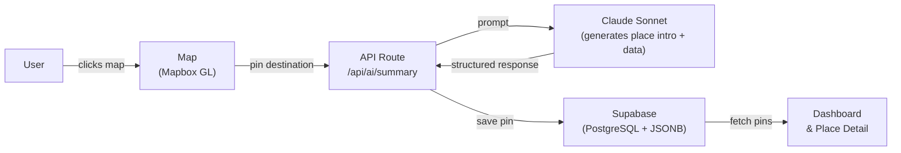

# Pinfarer

**Personal travel map + AI trip planner** — pin places you've visited, want to visit, or dream about, then let Claude build your itinerary.

[](https://pinfarer.vercel.app)
[](https://nextjs.org)
[](https://www.typescriptlang.org)
[](https://vercel.com)

**Live demo:** [pinfarer.vercel.app](https://pinfarer.vercel.app)

---

## Why I Built This

I have a habit of saving interesting places I see on YouTube or social media — a hidden town in Tuscany, a coastal trail in Japan, a neighbourhood cafe someone mentioned in a vlog. The problem: they'd end up scattered across browser bookmarks, notes apps, and WeChat messages, and I'd forget about them completely.

I wanted one place to pin every destination I dream about, have visited, or want to revisit. And when I'm actually planning a trip, I wanted AI to take those saved pins and turn them into a real day-by-day itinerary — not just a generic list, but one that knows the places I care about.

---

## Features

### Interactive Globe Map
- Mapbox GL globe projection with real ocean colors
- Click any pin to fly to its location with smooth animation
- Filter by status: Visited / Watchlist / Dream
- Filter by tags
- Sidebar pin list

### Place Details
- Hero image (Mapbox satellite + Pixabay photo fallback)
- AI-generated introduction via Claude Sonnet 4.6
- **City data:** population, language, currency, climate, food culture, visa info, safety level, notable animals
- **Property data:** council, schools, transport score, CBD distance, median price range
- Personal notes with auto-save
- Status selector (Visited / Watchlist / Dream)
- Nearby places in the same country

### Dashboard
- KPI cards: total pins, visited, watchlist, dream counts
- SVG donut chart — status distribution
- Horizontal bar chart — discovery source breakdown (YouTube, WeChat, 小红书, etc.)
- Country/region ranked list with progress bars
- Tags cloud

### AI Trip Planner
- Select saved pins to include in the itinerary
- Configure: destination, trip length (3–14 days), travel style, preference tags
- Claude generates a day-by-day itinerary with timed activities
- Live Mapbox map shows selected pins + dashed route line

### KML Import
- Drag & drop Google Takeout KML files
- Preview parsed places before importing
- Set status per place before confirming

---

## Architecture



---

## Tech Stack

| Layer | Technology |
|---|---|
| Framework | Next.js 14 (App Router) |
| Language | TypeScript 5 |
| Map | Mapbox GL JS (globe projection) |
| AI | Anthropic Claude Sonnet 4.6 |
| Database | Supabase (PostgreSQL + JSONB) |
| Images | Pixabay API (server-side proxy) |
| Styling | Tailwind CSS + shadcn/ui |
| Deploy | Vercel |

---

## Getting Started

### Prerequisites

- Node.js 18+
- A [Supabase](https://supabase.com) project
- A [Mapbox](https://mapbox.com) token (free tier works)
- An [Anthropic](https://console.anthropic.com) API key
- A [Pixabay](https://pixabay.com/api/docs/) API key (free)

### 1. Clone & install

```bash
git clone https://github.com/sarahwangy/pinFarer.git
cd pinFarer/pinfarer
npm install
```

### 2. Environment variables

Create `.env.local` inside the `pinfarer/` directory:

```env
# Supabase
NEXT_PUBLIC_SUPABASE_URL=https://your-project.supabase.co
NEXT_PUBLIC_SUPABASE_ANON_KEY=your-anon-key

# Mapbox
NEXT_PUBLIC_MAPBOX_TOKEN=pk.eyJ1...

# Anthropic
ANTHROPIC_API_KEY=sk-ant-...

# Pixabay
PIXABAY_API_KEY=your-pixabay-key

# NextAuth (if using auth)
NEXTAUTH_SECRET=your-secret
NEXTAUTH_URL=http://localhost:3005
```

### 3. Supabase schema

Run this SQL in the Supabase SQL Editor:

```sql
create table if not exists pins (
  id          uuid primary key default gen_random_uuid(),
  user_id     uuid,
  name        text not null,
  country     text,
  region      text,
  lat         double precision not null,
  lng         double precision not null,
  status      text not null default 'watchlist',
  source      text not null default 'unknown',
  source_url  text,
  notes       text,
  ai_summary  text,
  place_data  jsonb,
  tags        text[] default '{}',
  created_at  timestamptz default now()
);
```

### 4. Run locally

```bash
npm run dev
# → http://localhost:3005
```

---

## Environment Variables

| Variable | Required | Description |
|---|---|---|
| `NEXT_PUBLIC_MAPBOX_TOKEN` | Yes | Mapbox public token for the globe map |
| `ANTHROPIC_API_KEY` | Yes | Anthropic API key for Claude Sonnet |
| `NEXT_PUBLIC_SUPABASE_URL` | Yes | Supabase project URL |
| `NEXT_PUBLIC_SUPABASE_ANON_KEY` | Yes | Supabase anonymous key |
| `PIXABAY_API_KEY` | Yes | Pixabay key for place images (server-side only) |
| `NEXTAUTH_SECRET` | If using auth | NextAuth secret for session signing |
| `NEXTAUTH_URL` | If using auth | Base URL of your app |

---

## Deploy to Vercel

1. Push to GitHub
2. Import the repo at [vercel.com/new](https://vercel.com/new)
3. Set **Root Directory** to `pinfarer`
4. Add all environment variables listed above
5. Click Deploy

Every `git push` to `main` triggers automatic redeployment.

---

## Project Structure

```
pinfarer/
├── app/
│   ├── page.tsx                  # Map home page
│   ├── dashboard/page.tsx        # Stats dashboard
│   ├── ai/page.tsx               # AI trip planner
│   ├── import/page.tsx           # KML import
│   ├── place/[id]/page.tsx       # Place detail
│   ├── place/[id]/detail/        # Expanded place detail
│   └── api/
│       ├── pins/                 # CRUD for pins
│       ├── ai/summary/           # Claude place introduction
│       ├── ai/itinerary/         # Claude trip planner
│       ├── geocode/              # Mapbox geocoding proxy
│       └── pixabay/              # Pixabay image proxy
├── components/
│   ├── Map.tsx                   # Mapbox globe
│   ├── MapPage.tsx               # Home page shell + nav
│   ├── Sidebar.tsx               # Pin list sidebar
│   ├── FilterBar.tsx             # Status / tag filters
│   ├── place/                    # Place detail components
│   ├── dashboard/                # Dashboard chart components
│   └── ai/                      # AI planner components
├── lib/
│   ├── kml-parser.ts             # Google Takeout KML parser
│   ├── place-type.ts             # City vs property detection
│   └── supabase.ts               # Supabase client
└── types/
    ├── pin.ts                    # Pin, CityData, PropertyData types
    └── itinerary.ts              # Itinerary, DayPlan, Activity types
```
