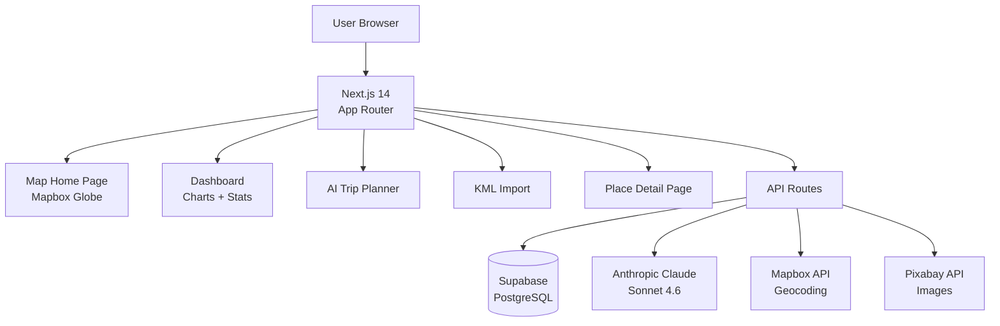
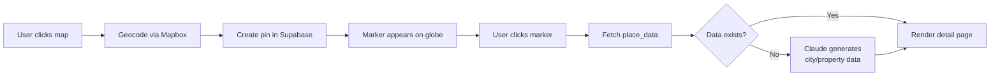
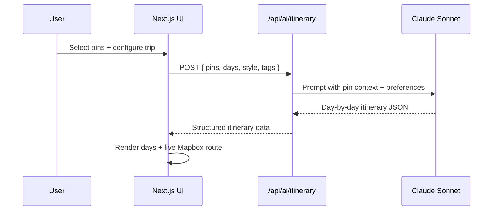
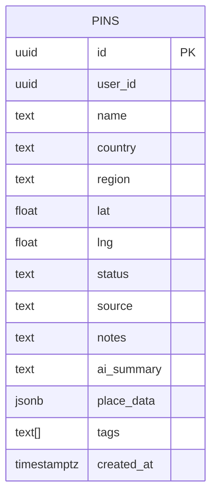
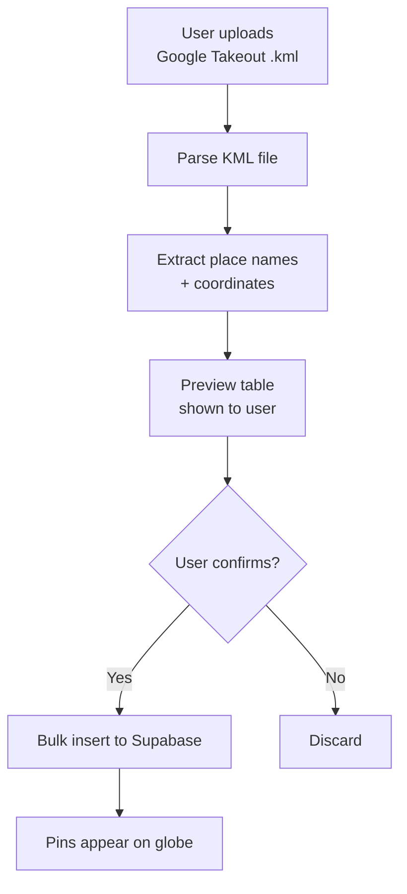

# Architecture Diagrams — Pinfarer Travel

## System Architecture

```mermaid
graph TD
    User[User Browser] --> Next[Next.js 14\nApp Router]
    
    Next --> MapPage[Map Home Page\nMapbox Globe]
    Next --> Dashboard[Dashboard\nCharts + Stats]
    Next --> AIPlanner[AI Trip Planner]
    Next --> Import[KML Import]
    Next --> PlaceDetail[Place Detail Page]
    
    Next --> API[API Routes]
    API --> Supabase[(Supabase\nPostgreSQL)]
    API --> Claude[Anthropic Claude\nSonnet 4.6]
    API --> Mapbox[Mapbox API\nGeocoding]
    API --> Pixabay[Pixabay API\nImages]
```

## Pin Data Flow

```mermaid
flowchart LR
    A[User clicks map] --> B[Geocode via Mapbox]
    B --> C[Create pin in Supabase]
    C --> D[Marker appears on globe]
    D --> E[User clicks marker]
    E --> F[Fetch place_data]
    F --> G{Data exists?}
    G -->|No| H[Claude generates\ncity/property data]
    G -->|Yes| I[Render detail page]
    H --> I
```

## AI Trip Planner Flow

```mermaid
sequenceDiagram
    participant U as User
    participant UI as Next.js UI
    participant API as /api/ai/itinerary
    participant C as Claude Sonnet

    U->>UI: Select pins + configure trip
    UI->>API: POST { pins, days, style, tags }
    API->>C: Prompt with pin context + preferences
    C-->>API: Day-by-day itinerary JSON
    API-->>UI: Structured itinerary data
    UI->>UI: Render days + live Mapbox route
```

## Database Schema

```mermaid
erDiagram
    PINS {
        uuid id PK
        uuid user_id
        text name
        text country
        text region
        float lat
        float lng
        text status
        text source
        text notes
        text ai_summary
        jsonb place_data
        text[] tags
        timestamptz created_at
    }
```

## KML Import Flow

```mermaid
flowchart TD
    A[User uploads\nGoogle Takeout .kml] --> B[Parse KML file]
    B --> C[Extract place names\n+ coordinates]
    C --> D[Preview table\nshown to user]
    D --> E{User confirms?}
    E -->|Yes| F[Bulk insert to Supabase]
    E -->|No| G[Discard]
    F --> H[Pins appear on globe]
```
